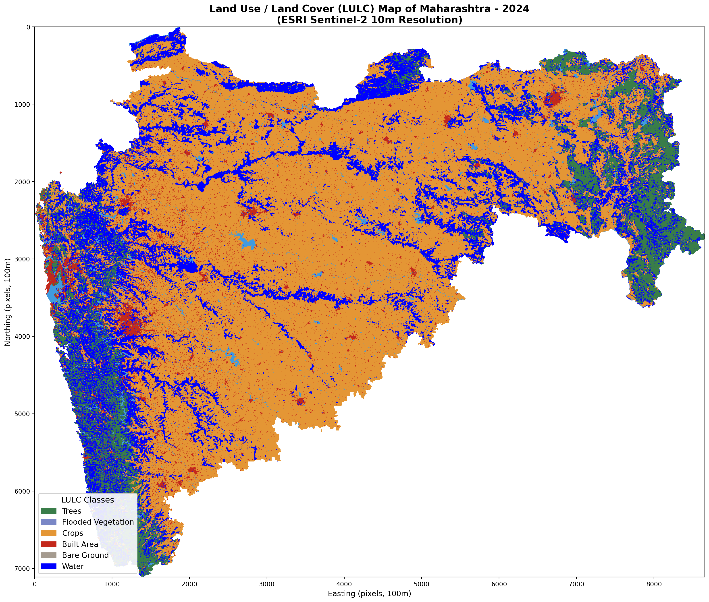
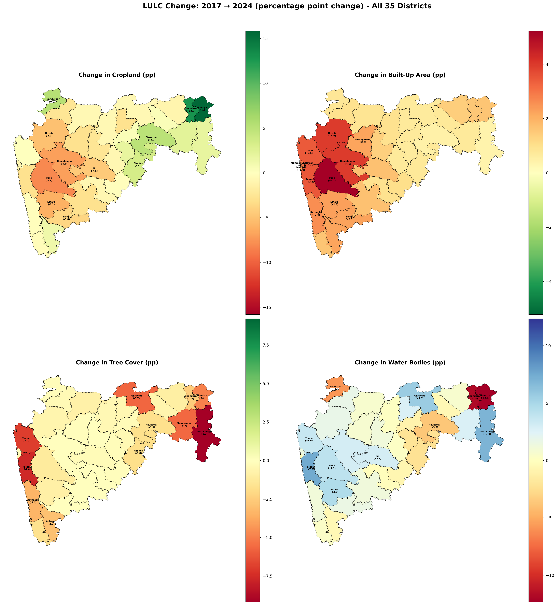
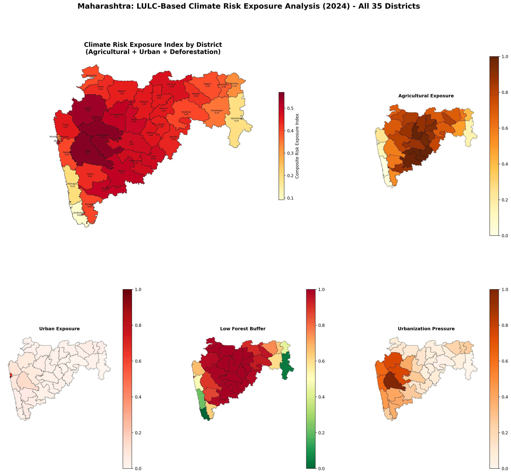

# Spatial Mapping of LULC Exposure in Maharashtra

**CM801 — Climate Studies Risk Analysis | IIT Guwahati | Spring 2025–26**

A comprehensive spatial analysis of Land Use and Land Cover (LULC) exposure across all 35 districts of Maharashtra using ESRI Sentinel-2 10m satellite data (2017 & 2024), including a composite Climate Risk Exposure Index (CREI).

---

## Key Findings

| Metric | 2017 | 2024 | Change |
|--------|------|------|--------|
| Crops | 196,079 km² (65.1%) | 193,438 km² (64.1%) | −2,641 km² |
| Trees | 36,841 km² (12.2%) | 30,841 km² (10.2%) | **−6,000 km²** |
| Built Area | 10,153 km² (3.4%) | 15,710 km² (5.2%) | **+5,557 km²** |
| Water | 57,785 km² (19.2%) | 61,407 km² (20.4%) | +3,622 km² |

**Most exposed districts:** Pune (0.571), Ahmadnagar (0.560), Nashik (0.542)  
**Least exposed districts:** Sindhudurg (0.092), Garhchiroli (0.195), Ratnagiri (0.201)

## Sample Outputs

### LULC Map (2024)


### District-Level Change Detection (2017 → 2024)


### Climate Risk Exposure Index


## Data Sources

| Dataset | Source | Resolution |
|---------|--------|------------|
| ESRI Sentinel-2 LULC (2017, 2024) | [ArcGIS Living Atlas](https://livingatlas.arcgis.com/landcoverexplorer/) | 10 m |
| State & District Boundaries | [DataMeet](https://github.com/datameet/maps) | Vector |

**Tiles used:** 43P, 43Q (UTM Zone 43N) + 44Q (UTM Zone 44N) — covering all 35 districts.

## Methodology

1. **Reprojection & Mosaicking** — 44Q reprojected from UTM 44N → 43N; all tiles merged
2. **Clipping** — Merged raster clipped to Maharashtra state boundary
3. **Zonal Statistics** — Per-district and per-grid (25 km) LULC area computation
4. **Change Detection** — 2017 vs 2024 percentage point and absolute area change
5. **CREI** — Composite index from 5 weighted sub-indicators:

```
CREI = 0.25·E_agri + 0.20·E_urban + 0.20·E_forest + 0.20·E_urb_press + 0.15·E_defor
```

## Repository Contents

```
├── report.tex                          # LaTeX source
├── report.pdf                          # Compiled report (13 pages)
├── LULC_Exposure_Maharashtra_Presentation.pptx  # Presentation (13 slides)
├── fig1–fig8 (*.png)                   # All generated figures
├── district_lulc_2024.csv              # District LULC stats (2024)
├── district_lulc_2017.csv              # District LULC stats (2017)
├── district_lulc_change_2017_2024.csv  # Change detection data
├── district_risk_exposure_index.csv    # CREI per district
└── gridded_lulc_2024.csv              # 25km grid LULC stats
```

> Raw `.tif` raster files are excluded (too large for Git). Download them from the [Living Atlas](https://livingatlas.arcgis.com/landcoverexplorer/).

## Tools

Python 3.13 with `rasterio`, `geopandas`, `shapely`, `matplotlib`, `numpy`, `pandas`

## Team

| Name | Roll Number |
|------|-------------|
| Nawang Tashi | 2360760 |
| Shourya Goyal | 2360733 |
| Rushabh Bonde | 2360703 |
| Sajjad Nakhwa | 2360702 |
| Tushar Bajaj | 23B2107 |
